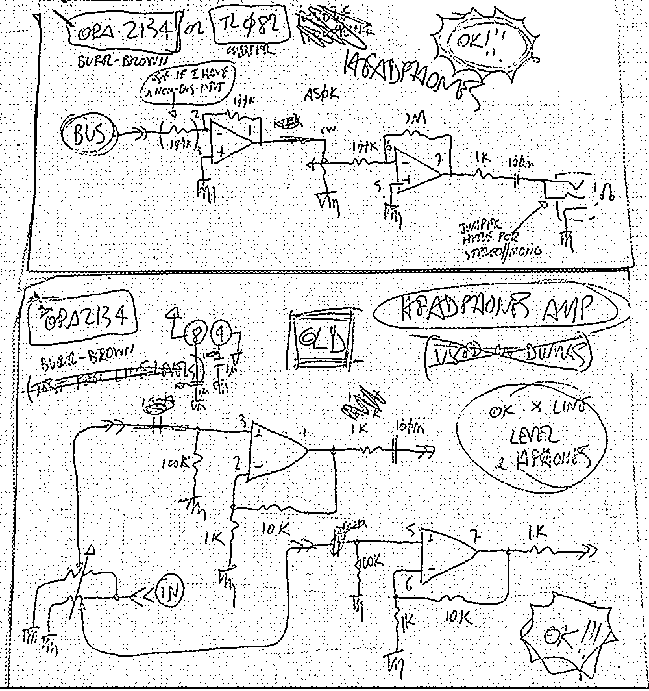
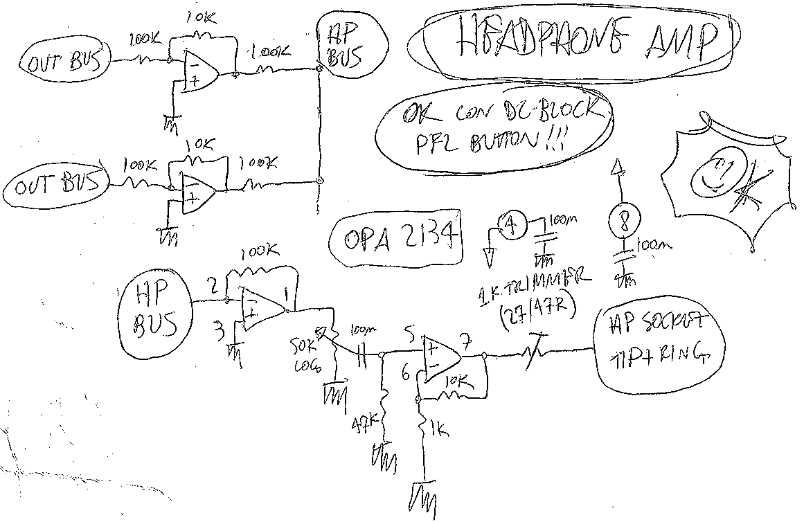
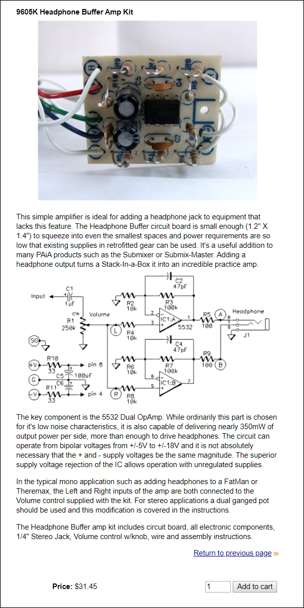

# Headphones Driver
###### App Note nhan002

## Main schematics:

## Other ideas:

---

     <a href="../README.md">
          
</a>

<!--

,,headphones
,,headphone
,,amp
,,amplifier
,,pfl
,,opa 2134
,,tl 082
,,tl082
,,082
,,tl 072
,,tl072
,,072
,,bus
,,burr-brown
,,eurorack

-->