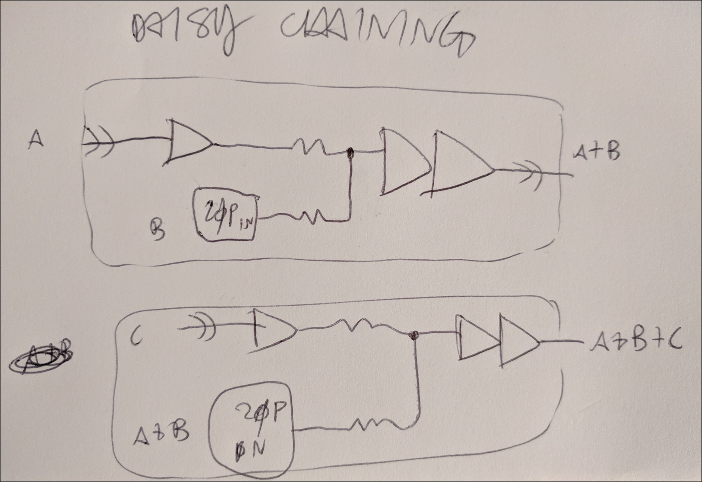
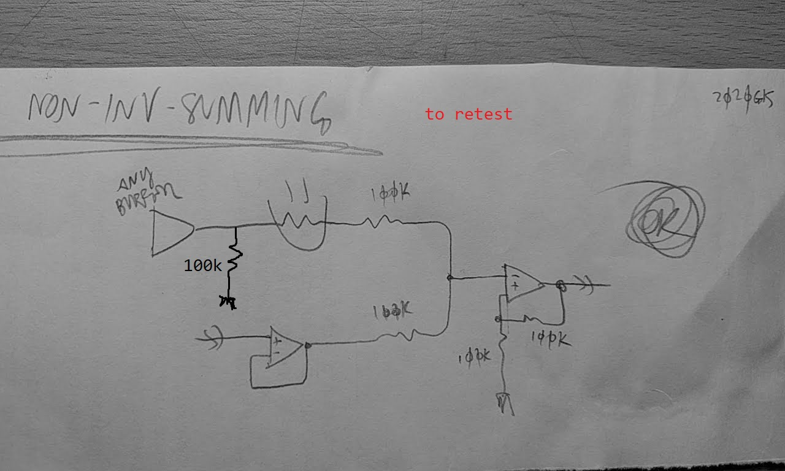

### nhan001    

# Mixing with OpAmps

[Go to App Note nhan001](http://htmlpreview.github.io/?https://github.com/noizhardware/electronics-app-notes/blob/master/nhan001/nhan001.html "App Note HTML page")

N O P E

- see also https://sound-au.com/dwopa.htm

* in caso di (gain > 1), mettere sempre il gain il più "alla fine" possibile, quando possibile
  - mantenere il segnale con (gain == 1) per il più possibile, per evitare distorsioni e bleed.
  - ad esempio vedi il softswitch `SSPST_v_2_0`, giova esattamente di sta cosa qui!
  - è buono anche per un altro motivo; hi-voltages don't go to GND! se ho un gain alto all'inizio, poi se ho un volume pot, quando è a zero, manderà il segnale ad alto voltaggio nella GND, rischiando di creare disto-bleed!!!
  - **è probabilmente il motivo per cui succedeva il noise con `weston`**

~~~~
(signal+noise) :
(s+n)>>(3xGain)>>(3s+3n)>>(+noise)>>(3s+4n)
(s+n)>>(+noise)>>(s+2n)>>(3xGain)>>(3s+6n) putting gain at the end of thr chain is WORSE!
~~~~
  
* **resistor tradeoff:**
  in inverting summer config:
  - hi res value (100k) >> more thermal noise(louder noise floor)
  - low res value (47k, 10k) >> no thermal noise, distortion may happen
  - **after testing (2020g01):** see _resistor-tradeoff.png_
  - nope. tested with 100k, 47k, 10k resistors. using a 10Vpk sine to check for extreme scenarios. all the same:
     - noticed no distortion, and no increase-decrease in noise floor levels
  - also tried with a floating input (adding a 1M pull-down, that should be a worst-case-scenario)
    - noise floor with floating input was unchanged
  - **conclusion: use 100k if you can**, provides a better isolation and cross-talk prevention
    - when using long bus lines, it may help to use smaller summing resistors (see _antennanoise_), but in all other scenarios, stick with 100k and be happy
    
---
## images:

daisy chaining

extra in

inv-noninv_mixed_bus

inv-noninv_mixed_bus2

meagherMainOut

mixed_resistors_bus

mtx_in8765_v00

nested_bus

non-inverting-splitter

non-inverting-summer

non-inverting-summer-2

opamp-gain

outbus_volume

resistor-network-termination

resistor-tradeoff

single-opamp-gain

standard_bus

summing_bus_multiplication

vol-nonvol_mixed_bus

  
,,summing
,,noise
,,noisefloor
,,distortion
,,opamp
,,resistor
,,tradeoff