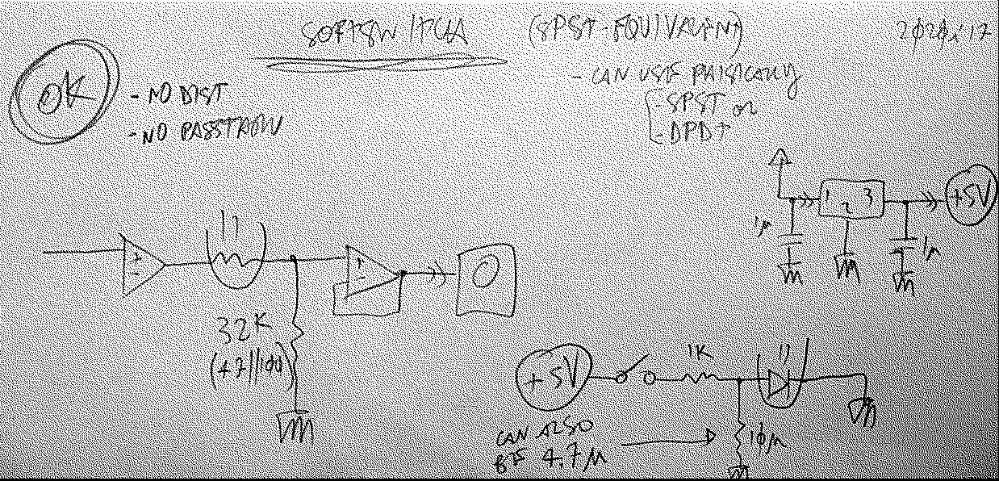
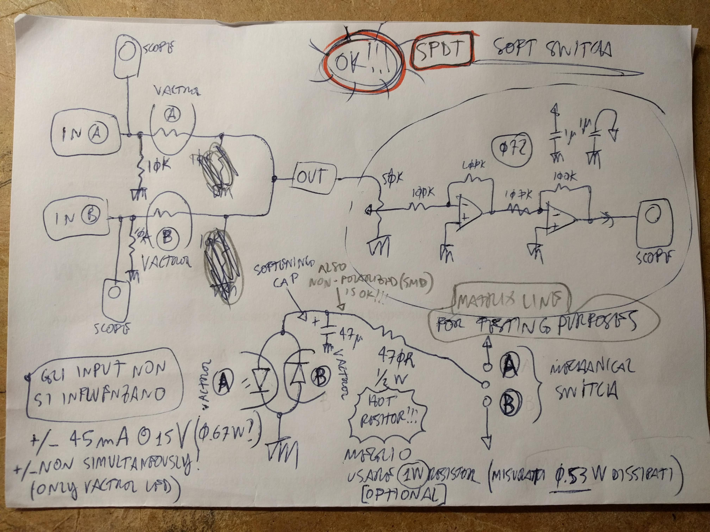

## henrik
il più semplice, piu promettente per ora, da testare in production
**testato 2020i03** - è OK, no bleedthru, no distorsione! (fare attenzione alle light leaks sul vactrol, deve essere ben isolato o al buio totale)
So, this is the building block schematic, tested 2020i17-1652 :

notes:
- it is an equivalent of using an SPST switch
  - it can use a physical SPST, or SPDT, or basically anything
- led cap is there to smooth the OFF>>ON transition, which would be to clicky without it
  - also the ON>>OFF transition is influenced, sometimes it's too long, so you should use the smallest cap possible to just get rid of the OFF>>ON click. 4.7uF looks like a good value.
- 32k pull-down resistor is ideal: shunts enought signal so when muted is really silent, and is not small enought to "squash" and distort the signal when ON.

---

## SPDT
### funziona, ma con le dovute riserve
### this is intended as an `output` stage, the final selector between two signals

#### in teoria la versione completa andrebbe fatta con 4 vactrol... **vedi 4vactrolz.jpg**
  * il pcb `MTX_pedal7_v_0_0` introduce armoniche nel segnale, quando lo switch è `ON`.
  * con una sinewave da 5Vpk lo fà, de uso una sine da 1Vpk, non lo fa, ma c'è un transiente distorto quando flippo lo switch
  * provo a rimettere le 10k shunts
  * ascoltando nina simone, e switchando tra processed e unprocessed con un modulo di switch passivo, ho notato che distorce un po con i volumi alti
  * provo a togliere di nuovo le 10k shunt
  * **OK SENZA LE SHUNT!!!**
- nella cartella `snd` ci sono due .wav che mostrano uno switching clickless VS clicky

#### `OK` @ +/-15V
#### @ +/-12V sembra ci sia un po di distorted bleedthru in alcuni casi

* le due shunt-res da `10k` devono essere omesse in alcuni casi, perchè possono trasportare distorted bleedthru alla GND.
  + si puo fare che le lascio facoltative da montare
  + ad esempio, col send-return volume pedal (MTX_pedal7_v_0_0) sono facoltative

| //         | plain         | pedal               |
|------------|---------------|---------------------|
| 15v +10k   | `OK`            | `OK`                  |
| 15v NO 10k | not 100% mute | `OK`                  |
| 12v +10k   | `OK`            | distorted bleedthru |
| 12v NO 10k | not 100% mute | `OK`                  |

## SSPST v.2.0
#### Soft Single Pole Single Throw
  * vedi SSPST_v_2_0.jpg
  * di base si puo prendere il SPST vecchio e semplicemente non bisogna mai mettere il gain prima dei vactrol, sempre DOPO!

## SPST
  * `SPST.jpg` mostra un po di configurazioni in cui funziona bene, testate
  * `meagher-SPST.jpg` mostra un'ulteriore configurazione, embeddata in un mixer (poi non è davvero per Meagher, che necessita ti un SPDT)
  * `SPST-bufferpost.jpg` è una versione con un solo vactrol, con pochissimo passthru **USE WITH CAUTION**
---

#### TODO
  - re-test `SPDT` alla luce delle nuove scoperte in spst (???)
  - try H11F optocouplers (datasheet with appnote here in folder)(0.42€ each)

<!--
,,switch
,,,vactrol
,,soft
,,silent
,,noise
,,click
,,clickless
,,h11
,,h11f1
,,h11f1m
,,opto
,,optocoupler
,,optocoupling
,,fet
-->