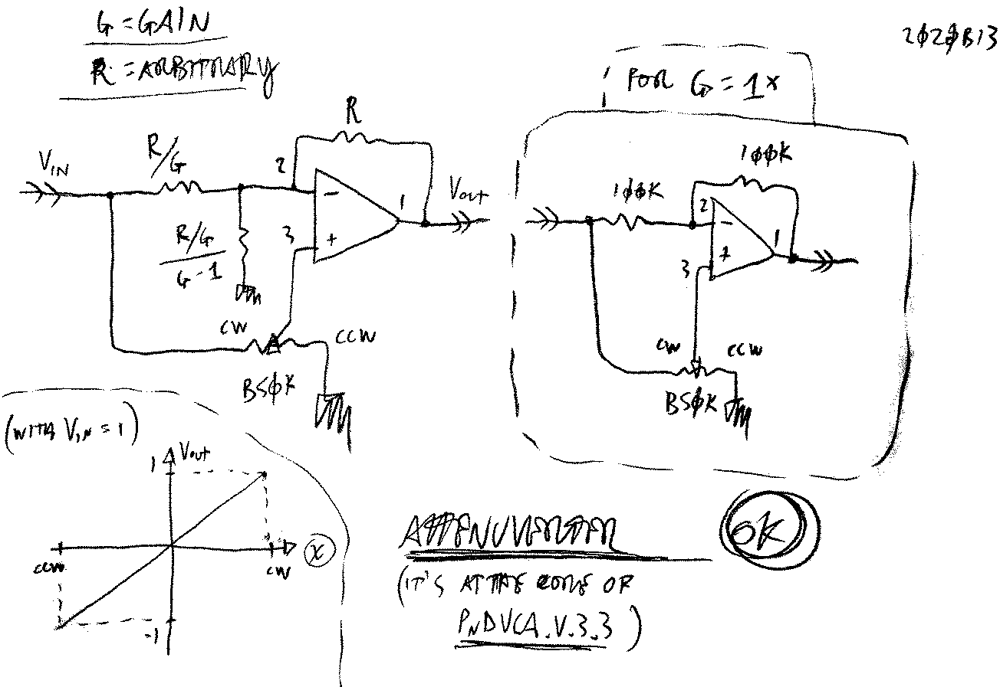

# Attenuverter
###### App Note nhan026

**see notes from pnd.v.3.3.2 about leaky DIP packages and floating input audio leak**

Using `opa-x134` op-amps does usually solve the problem.

**ALSO** use `47k` resistors (see pnd) to flatten the function near the center.

**TO TEST:** polarity swapp >> inverted output???

---

     <a href="../README.md">
          
</a>

<!--

,,attenuverter

-->
