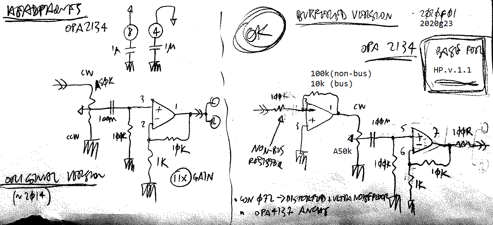
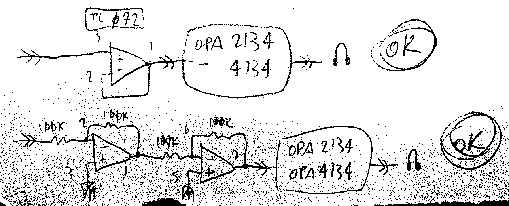
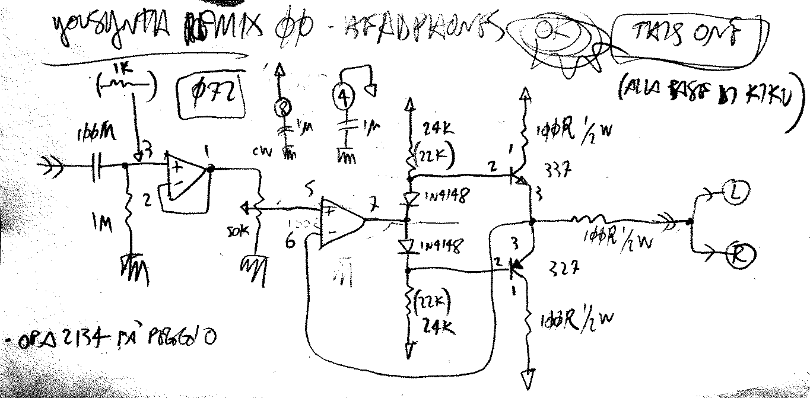

# Headphones Driver
###### App Note nhan002

## Main schematic:

On the left the original version, on the right the final version, can drive a single channel or two channels in parallel.

`100n` cap to block unwanted DC, for once :D

For stereo headphones, use 2 separated copies. You can use **opa4134**, quad version of the **opa2134**. OR use two separate **opa2134s** for a mono-stereo multi-purpose pcb.

The `non-bus` resistor is to be used when you have a single source coming in. In this case use `100k` resistors

If the source is a bus, use `10k` resistors. Each element of the bus should have its own `10k` summing resistor.

### as output stage:

Can also be used as output stage after other stages that might be using eg. **TL07x's**.

The `opa2134` at the end of the chain provides for the correct drive and impedance matching.

Can also be used as a general-purpose output stage, providing compatibility with headphones _and_ line out.

## ACHTUNG
the `opa2134` design is **inverting**, feed it an inverted signal if you're using it as a general-purpose output stage, to avoid phase inversion.

## Other ideas:

Adapted version from Yousynth. At the core of kiku_00

Still to be properly tested, will probably be ditched in favor of the simpler opa4134 version

---

     

<!--

,,headphones
,,headphone
,,amp
,,amplifier
,,pfl
,,opa 2134
,,opa2134
,,opa 4134
,,opa4134
,,tl 082
,,tl082
,,082
,,tl 072
,,tl072
,,072
,,bus
,,burr-brown
,,eurorack

-->