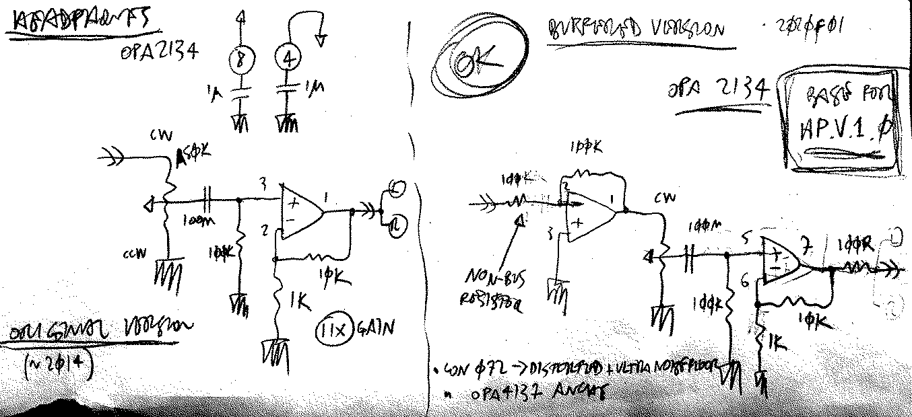
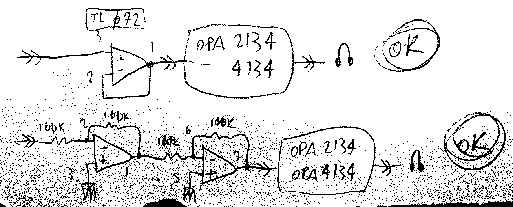
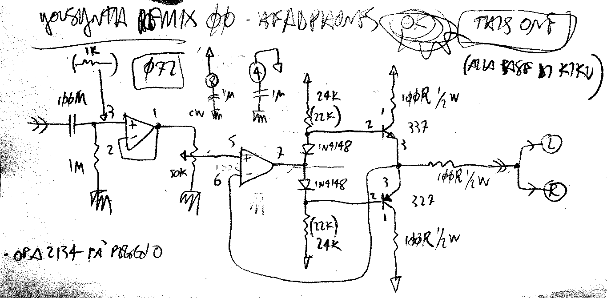

# Headphones Driver
###### App Note nhan002

## Main schematic:

On the left the original version, on the right the final version, can drive a single channel or two channels in parallel.

100n cap to block unwanted DC, for once :D

For stereo headphones, use 2 separated copies. Use opa4134, quad version of the 2134

The `non-bus` resistor is to be used when you have a single source coming in.
If the source is a bus, each element of the bus should have their own 100k summing resistor.

### as output stage:

Can also be used as output stage after others using eg. TL07x's.
The final opa2134 provides the correct drive and impedance matching
Can also be used as a general-purpose output stage, providing compatibility with headphones _and_ line out.
**ACHTUNG** the opa2134 design is **inverting**, feed it an inverted signal if you're using it as a general-purpose output stage, to avoid phase inversion.

## Other ideas:

Adapted version from Yousynth. At the core of kiku_00

Still to be properly tested, will probably be ditched in favor of the simpler opa4134 version

---

     

<!--

,,headphones
,,headphone
,,amp
,,amplifier
,,pfl
,,opa 2134
,,tl 082
,,tl082
,,082
,,tl 072
,,tl072
,,072
,,bus
,,burr-brown
,,eurorack

-->