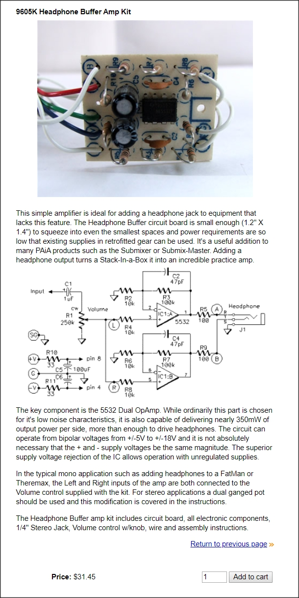
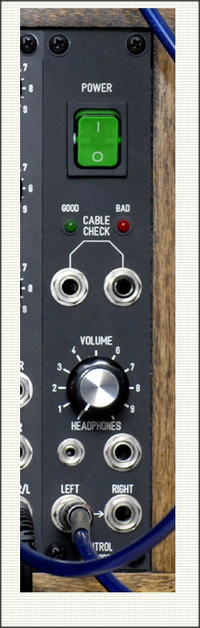
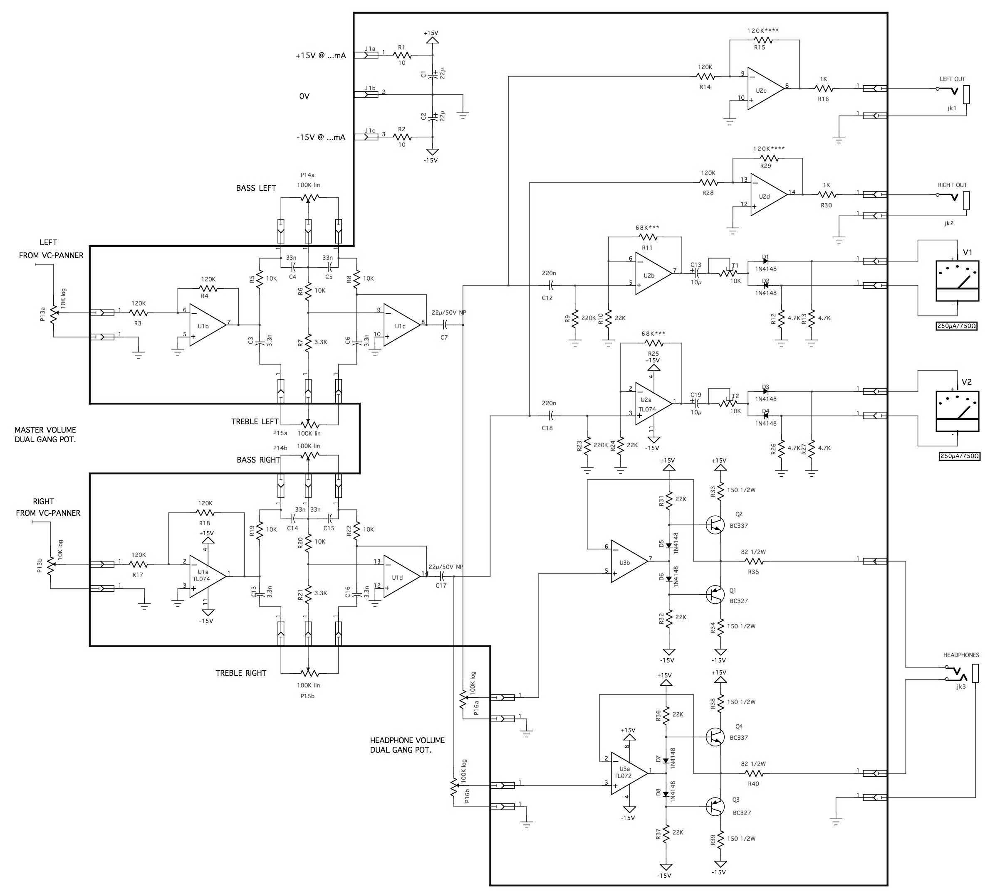

# Headphones Driver
###### App Note nhan002

## Main schematic:

On the left the original version, on the right the final version, can drive a single channel or two channels in parallel.
100n cap to block unwanted DC, for once :D
For stereo headphones, use 2 separated copies. Use opa4134, quad version of the 2134

## Other ideas:

---

     <a href="../README.md">
          
</a>

<!--

,,headphones
,,headphone
,,amp
,,amplifier
,,pfl
,,opa 2134
,,tl 082
,,tl082
,,082
,,tl 072
,,tl072
,,072
,,bus
,,burr-brown
,,eurorack

-->