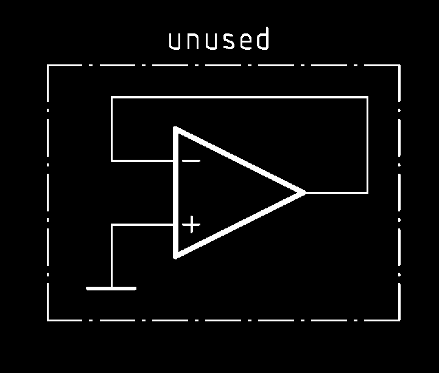

# Unused Op-Amp termination
###### App Note nhan003

* `(-)` input and output tied together, `(+)` input to `GND`
* see also : https://youtu.be/gwQiFuckMz0

---

     <a href="../README.md">
          
</a>

<!--

,,opamp
,,unused

-->