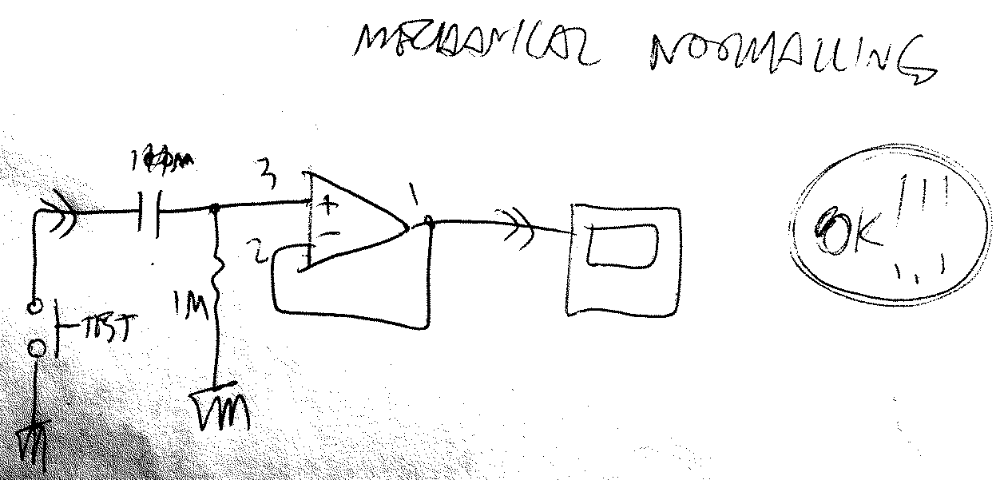

# Mechanical Normalling
###### App Note nhan010

* mechanical normalling can co-exist with a pull-down resistor, **AND** a DC-blocking capacitor
* it's got the advantage of suppressing input noise in case there is a cable inserted in the socket without anything connected on the other end (a _floating connection_)
* and still, when nothing is inserted in the socket, the mechanical normalling kicks in, securely grounding the input

---

     <a href="../README.md">
          
</a>

<!--

,,gain
,,varigain

-->