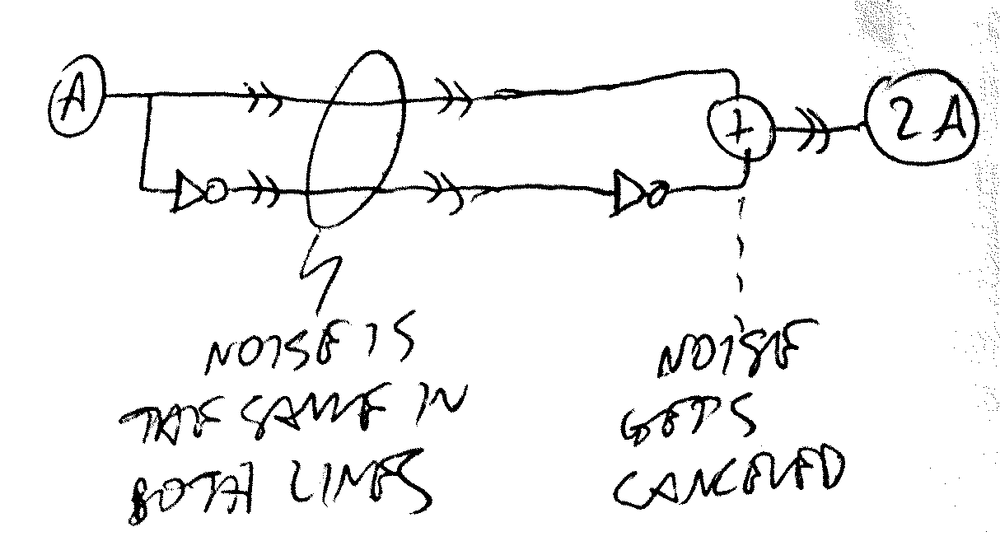
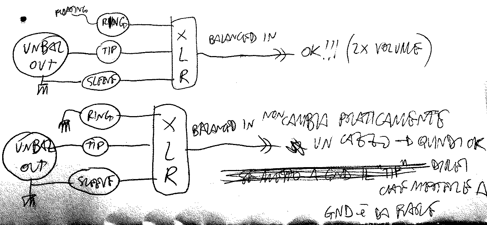
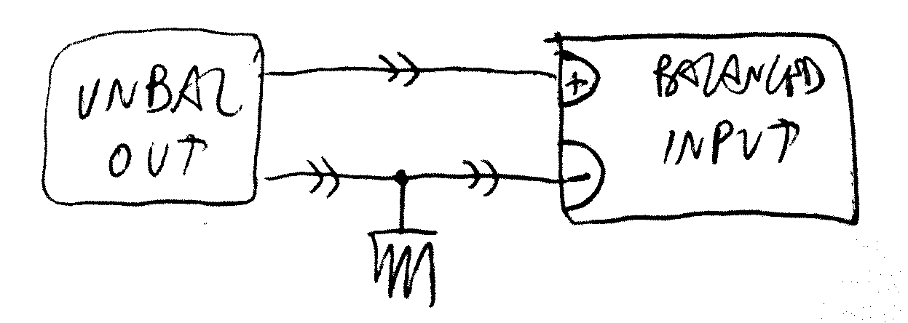
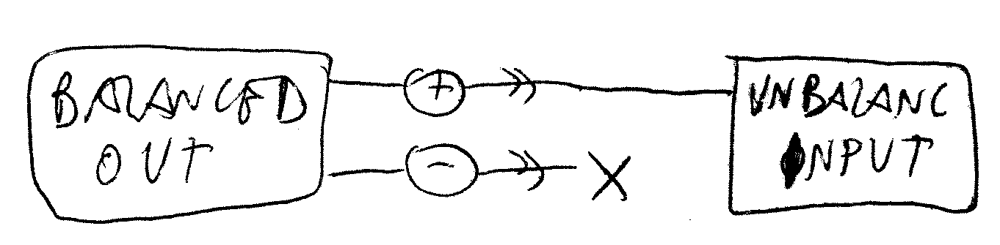
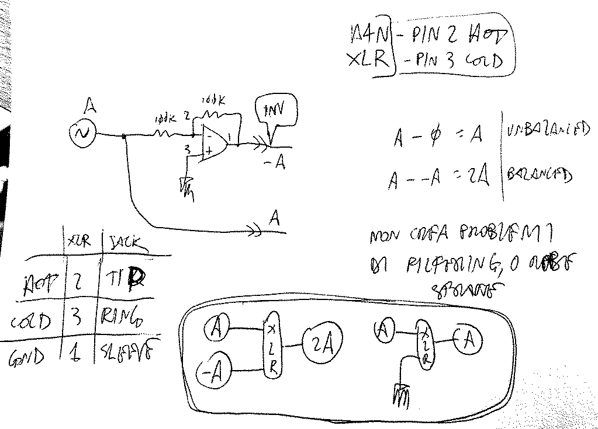

# Balanced and Unbalanced
###### App Note nhan011

## Basic functioning of balanced audio signal transmission

## `Unbalanced out` >> `Balanced in`
* if you want to build an `unbalanced output` that is fully compatible with a possible `balanced input` it will be connected to, tiyng the `ring`(_cold_ signal, the inverted on of the balanced couple) to `GND` is good practice.

* simpler block schematic:

## `Balanced out` >> `Unbalanced in`

- tests with feeding a balanced signal to my `Zoom H4n`'s balanced inputs
	+ note: you should add a non-inverting buffer just after the input, providing OPA-class buffering to the (+) output (2022h03-1854)
	+ note: you should add 100R output resistors (2022h03-1854)

### See also
- [Designing With Opamps - Part 3](https://sound-au.com/articles/dwopa3.htm)
- [Balanced Inputs & Outputs - The Things No-One Tells You](https://sound-au.com/articles/balanced-io.htm)
- [Design of High-Performance Balanced Audio Interfaces](https://sound-au.com/articles/balanced-2.htm) 10 ohms in parallel with 100nF (XLR GND)>>(chassis) // poi qui https://sound-au.com/project51.htm dice che bisogna sperimentare per capire da quale parte mettere questa cosa, se nel transmitter o nel receiver. e se lo metto da entrmbe le parti? BHO 2022h11-2306
- [Balanced Line Driver & Receiver](https://sound-au.com/project51.htm)
- [Balanced Transmitter and Receiver II](https://sound-au.com/project87.htm) << **USE THIS!!!** 2022h03-1602

---

     <a href="../README.md">
          
</a>

<!--

,,balanced
,,unbalanced
,,noise
,,connection
,,interconnection

-->