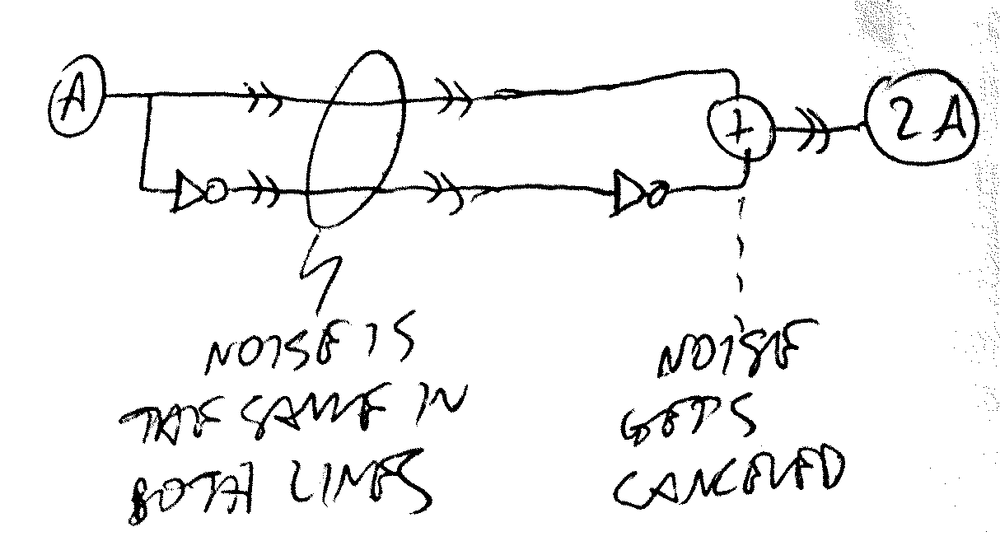
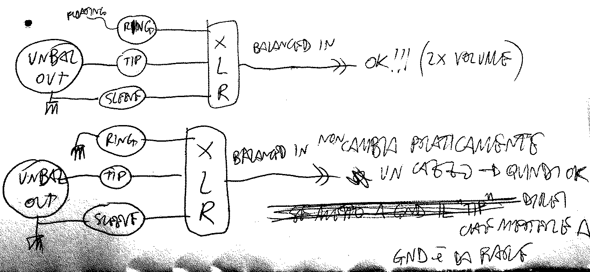
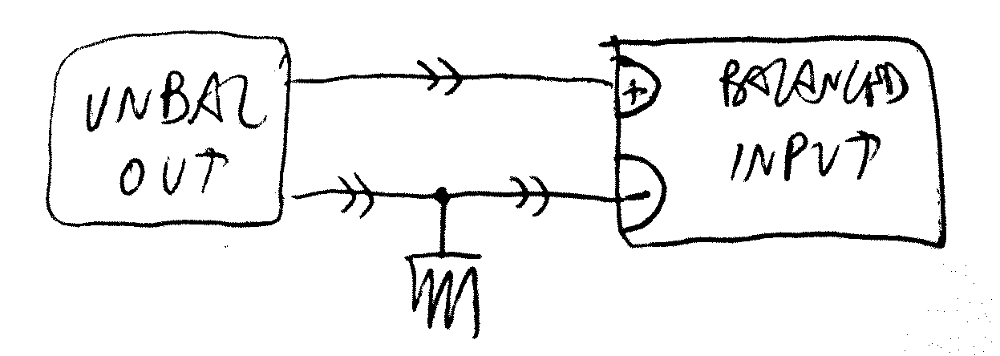
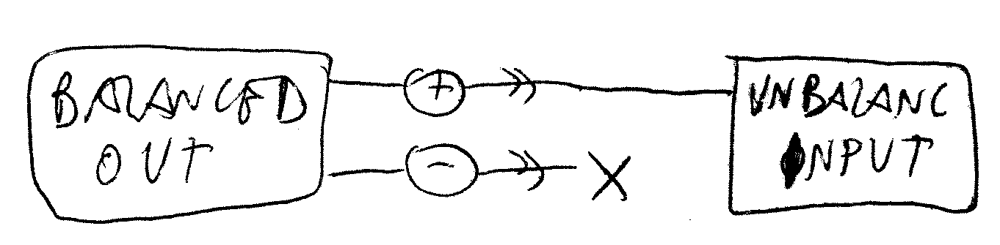
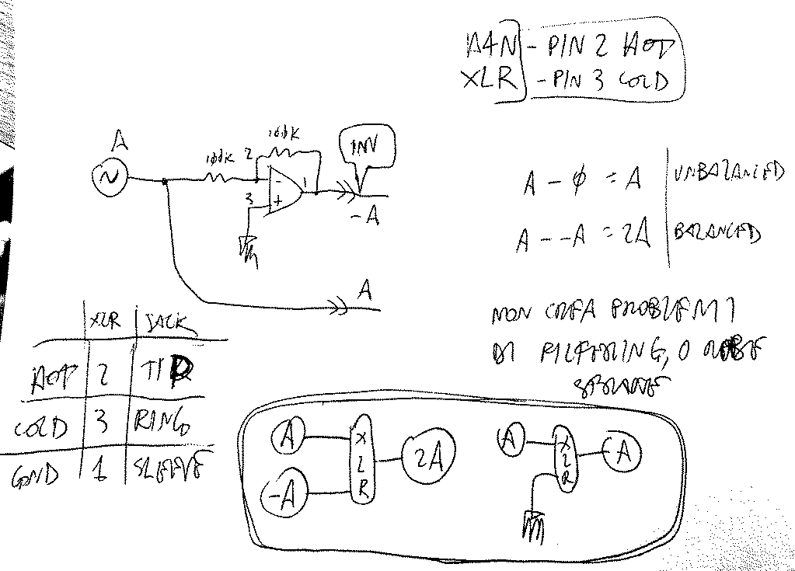

# Balanced and Unbalanced
###### App Note nhan011

## Basic functioning of balanced audio signal transmission

## `Unbalanced out` >> `Balanced in`
* if you want to build an `unbalanced output` that is fully compatible with a possible `balanced input` it will be connected to, tiyng the `ring`(_cold_ signal, the inverted on of the balanced couple) to `GND` is good practice.

* simpler block schematic:

## `Balanced out` >> `Unbalanced in`

- tests with feeding a balanced signal to my `Zoom H4n`'s balanced inputs

---

     <a href="../README.md">
          
</a>

<!--

,,balanced
,,unbalanced
,,noise
,,connection
,,interconnection

-->