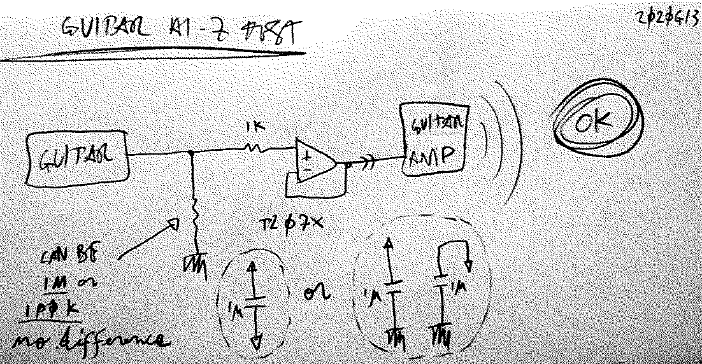

# Guitar hi-Z - impedance matching
###### App Note nhan018

The _pull down_ resistor can be either `1M` or `100k`.
In both cases there's no sound difference with the raw guitar plugged directly into the amp.

---

     <a href="../README.md">
          
</a>

<!--

,,impedance
,,guitar
,,instrument
,,hi-z
,,hiz
,,input

-->