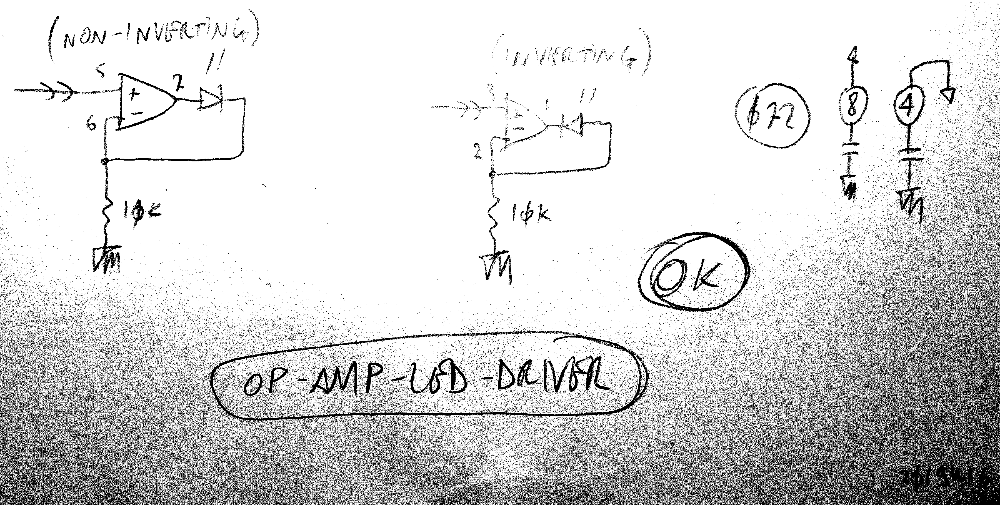
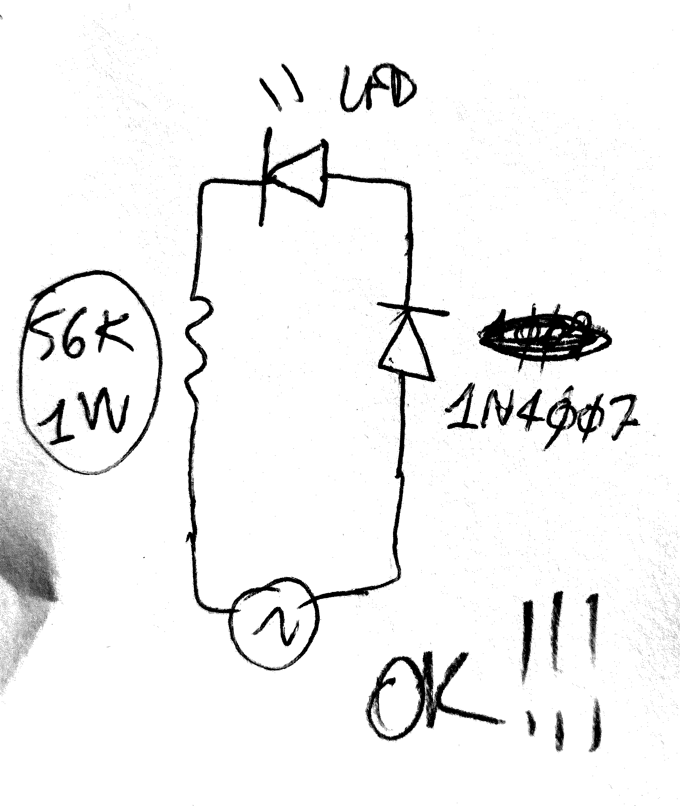
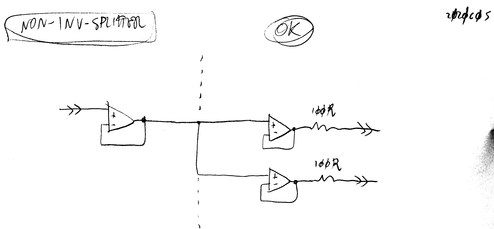
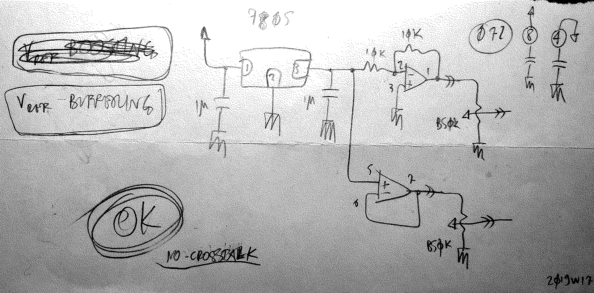

# Utilities
###### App Note nhan024

## LED driver

<!--
,,led
,,driver
-->

## linefinder

<!--
,,ac
,,line
,,phase
,,neutral
,,led
-->

## Splitter : non-inverting

<!--
,,split
,,noninv
,,signal
,,routing
-->

## Vref buffering (+/-)

<!--
,,vref
,,buffer
-->

---

     <a href="../README.md">
          
</a>

<!--

,,utilities

-->