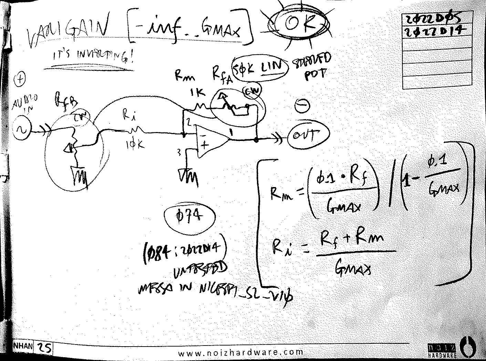
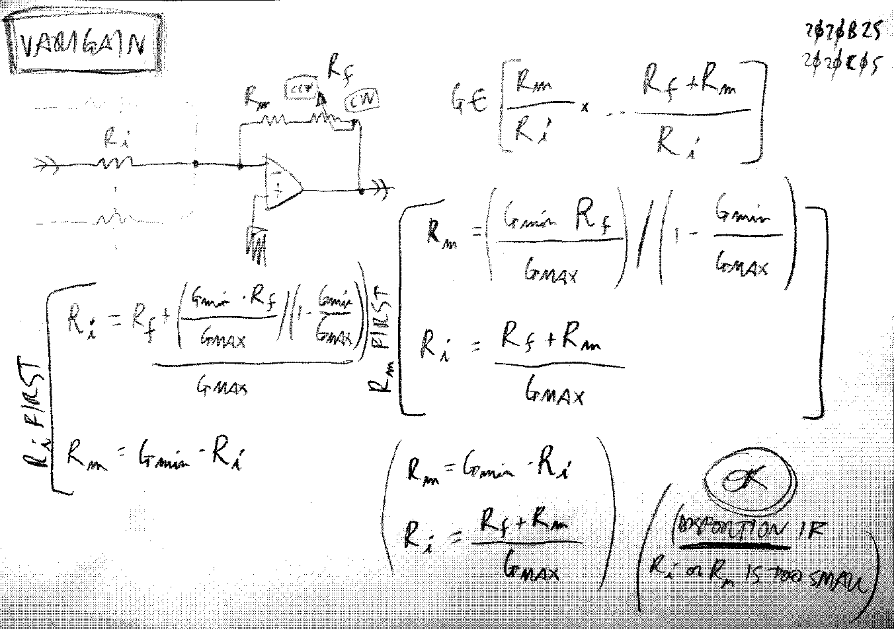
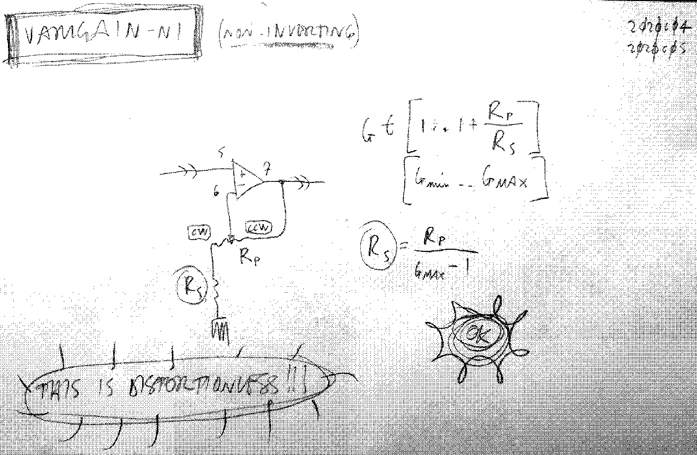

# Varigain
###### App Note nhan025

## Main schematics:

### range [-inf..Gmax] (inverting)
Use this if you want `-inf` as Gmin, you can't achieve it with the other architectures. This version is inverting.

**OK CONFIRMED WORKING** 2023c27-1706 : use a `TL08x`, the remaining opamps in the package can be also used in the rest of the circuit to safely handle audio signals

---

### range [Gmin..Gmax] (inverting)
This is the inverting version, might cause distortion in some cases. (very rare at this point, but just always be on the lookout for problems)

**ACHTUNG** (2021j28) always use a `TL08x`!!! It prevents distortion in most cases with this version.
In the end this is the most flexible version, as you're not stuck with a fixed `1x` for the **Gmin**.

Small resistor values for `Ri` and `Rm` might result in distortion. **ALWAYS TEST**

TODO: set lower limits for `Ri` and `Rm` to work without distortion.
     - (2021j28) used Ri=10k Rm=2k and Rf=B50k pot. All good (MTX_gain109876_v_0_0)

~~~~
Rm = ((Gmin * Rf) / Gmax) / (1 - (Gmin / Gmax))
Ri = (Rf + Rm) / Gmax
~~~~

kalk:

`Gmin Rf * Gmax / Gmin Gmax / 1 s - / .. ( Rm )` >> Rm

`Rf + Gmax / .. ( Ri )` >> Ri

~~~~
Rm = Gmin * Ri
Ri = (Rf + Rm) / Gmax
~~~~

---

### range [1x..Gmax] (non-inverting)
the non-inverting version is less versatile, but free from distortion and safe to use.
`Gmin` cannot be smaller than 1 in this configuration.

**Gmin** = 1

**Gmax** = 1 + Rp/Rs

**Rs** = Rp / (Gmax - 1)

---

     <a href="../README.md">
          
</a>

<!--

,,gain
,,varigain

-->
